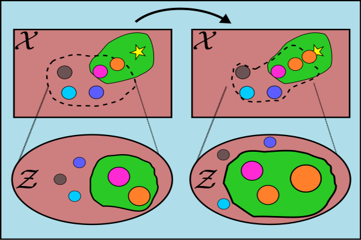

<div align="center">

# Sample-Efficient Optimization in the Latent Space of Deep Generative Models via Weighted Retraining

[](https://arxiv.org/abs/2006.09191)
[](https://proceedings.neurips.cc//paper/2020/hash/81e3225c6ad49623167a4309eb4b2e75-Abstract.html)




</div>

## Description

Official code repository for the paper
_Sample-Efficient Optimization in the Latent Space of Deep Generative Models via Weighted Retraining_.
It contains code to re-run the experiments and recreate all plots.

The code in this repository can be run in 3 ways:

1. All models can be trained from scratch.
2. The Bayesian optimization experiments can be re-run (using our pretrained models or custom-trained models)
3. The raw results can be plotted to reproduce our plots (using our official results or new results)

Our code is based on the pytorch lightning project template,
but does not use exclusively pytorch lightning
(one of our models is in tensorflow).

Feel free to contact us if you have any questions or issues with the code.
Our emails can be found in the paper; alternatively you can file a pull request on this repo.

## How to run

### Install Dependencies

First, install dependencies.
We recommend using [miniconda](https://docs.conda.io/en/latest/miniconda.html) to install dependencies,
particularly because [rdkit](http://www.rdkit.org/)
(a dependency used for the chemical design experiment)
is easy to install with conda and quite hard to install otherwise.

The notable dependencies are:

- pytorch (for the 2D shapes task and chemical design task)
- tensorflow (for the arithmetic expression task)
- gpflow (for Bayesian optimization)
- pytorch lightning
- rdkit (for the chemical design task)

```bash
# clone project and enter directory
git clone https://github.com/cambridge-mlg/weighted-retraining
cd weighted-retraining

# create conda env with basic requirements
conda env create -f env-basic.yml

# Alternatively, to recreate our exact environment, run:
# conda env create -f env-all.yml

# Activate the conda environment
conda activate weighted-retraining

# install project
python -m pip install -e .
```

### Set up Data

Second, run the following script to download and set up all the datasets.

**Note**: preprocessing the chemical dataset will take _several hours_, so this script will take a long time to terminate.

```bash
bash scripts/data/setup-all.sh
```

If you are only interested in reproducing some of the experiments,
you can instead run only the script you need
(e.g. `source setup-shapes.sh`).

### Training Models

**Note:** This section is optional, since pretrained models are provided
for all experiments.
To train each type of model:

1. Create a directory to store the models
2. Run the `train_MODEL` script with the desired parameters.

An example is given below:

```bash
model_dir="results/models/unweighted"
mkdir -p "$model_dir"
cd weighted_retraining

# Takes about 20min to train
# Final model is in "logs/train/shapes/lightning_logs/version_0/last.ckpt"
python train_shapes.py --root_dir="$model_dir"

# Takes about 1h to train
# Final model is in "results/models/unweighted/expr-k_inf.hdf5"
python train_expr.py --root_dir="$model_dir"

# Takes about 30h to train
# Final model is in "logs/train/chem/lightning_logs/version_0/last.ckpt"
python train_chem.py --root_dir="$model_dir"
cd -
```

The default parameters for all models are the ones used in the paper,
with the exception of the chemical task where a pretrained-model
from another repository was used as the base model.
The script here should however produce a fairly similar model.

For convenience, we give a script to train all the models used in this work:

```bash
bash scripts/models/train-paper.sh
```

Due to different implementations of random seeds on different systems,
you may not get the exact same results as us (in particular the visualizations for the latent space in the shapes task may be quite different).

### Run Optimization Experiments

**Note:** This section is optional,
since all our raw data is provided for plotting.
To run the core experiments
(the sample efficient optimization with weighted retraining),
run the `opt_MODEL` commands with the appropriate arguments.
The important arguments are:

- `--pretrained_model_file` is the path to the saved starting model
- `--weight_type` controls the type of weighting (either rank weighting or one of the baseline strategies)
- `--rank_weight_k` controls the degree of weighting (see paper for the exact definition)
- `--query_budget` controls the budget of function evaluations
- `--retraining_frequency` controls the retraining frequencies (number of epochs between retrainings)
- `--result_root` is the directory to save the results in
  (in particular, a file `results.npz` is created) in this location
  which contains the results to be plotted.

We provide a series of bash scripts to reproduce the results
of all expriments in our paper using our pretrained models.
These scripts will take a long time to finish on a single machine,
so it is recommended to run differents parts of the script on different machines to save time.
The different experiments within each script are clearly highlighted.

```bash
bash scripts/opt/shapes-paper.sh
bash scripts/opt/expr-paper.sh
bash scripts/opt/chem-paper.sh
```

### Evaluate and Plot Results

Finally, we include a jupyter notebook (`scripts/plots/plot-all.ipynb`) which can be used to reproduce all our plots using the official results.
This notebook essentially just reads the `results.npz` files and aggregates data across different seeds.

## Notes

- All of our experiments were run on computers with a GPU.
  Use the "--gpu" flag to run on GPU, omitting it will result in running on the CPU.
  By default it will run on all GPUs; use CUDA_VISIBLE_DEVICES=0
  to run just on a specific GPU.
  None of our code needs/supports multiple GPUs.
- All of our experiments were run on computers running Linux.
- If you have questions, please do not hesitate to contact us under the e-mail addresses listed in our linked paper.

## Credits

- Thanks to the authors of the [junction-tree neural network (JTNN)](https://github.com/wengong-jin/icml18-jtnn) and [grammar variational autoencoder (GVAE)](https://github.com/mkusner/grammarVAE) for providing their model implementations, which we based parts of our code on.
- Thanks to the authors of the [MOSES](https://github.com/molecularsets/moses) for their implementation of SA score which we copied for our experiments.

## Citation

If the contents of this repository were useful for your work, please consider citing our paper.
For now it is best to just cite the arxiv version of our paper.
We will update this later with the NeurIPS 2020 citation.

```bibtex
@article{tripp2020sample,
  title={Sample-Efficient Optimization in the Latent Space of Deep Generative Models via Weighted Retraining},
  author={Tripp, Austin and Daxberger, Erik and Hern{\'a}ndez-Lobato, Jos{\'e} Miguel},
  journal={arXiv preprint arXiv:2006.09191},
  year={2020}
}
```
